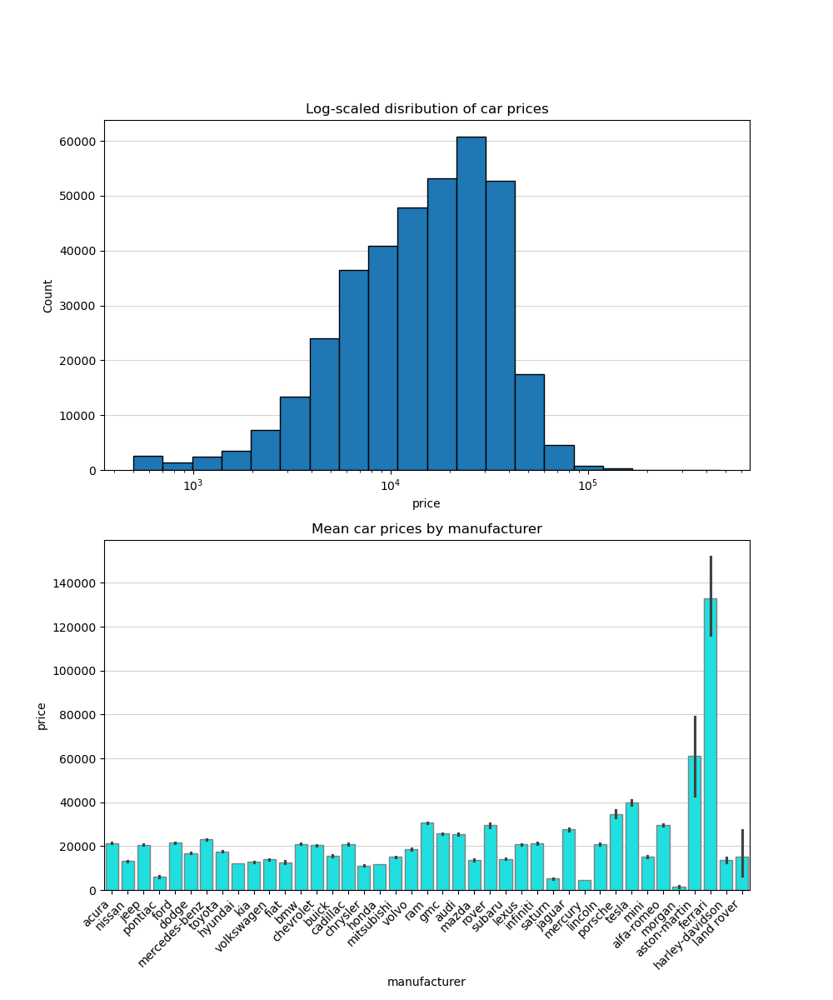
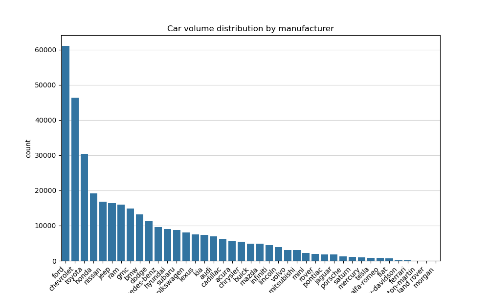
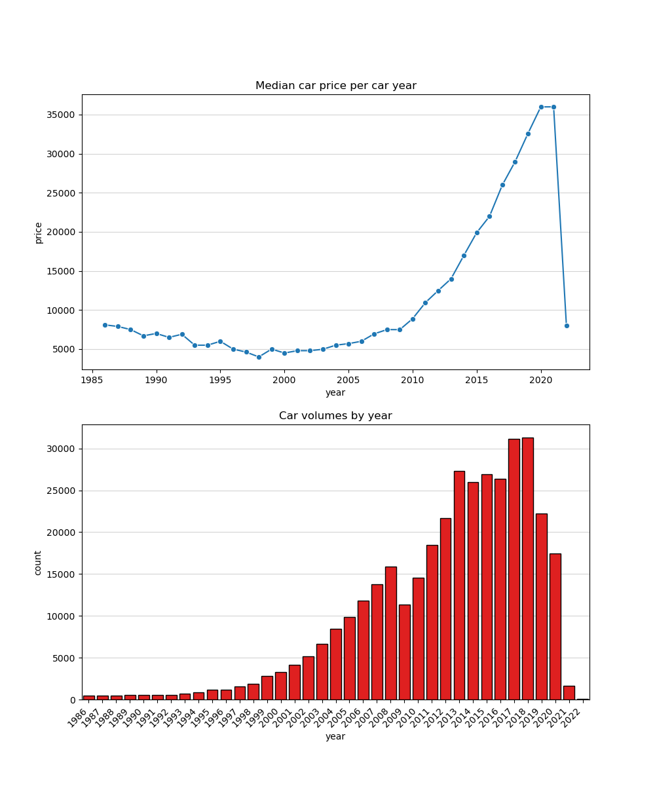
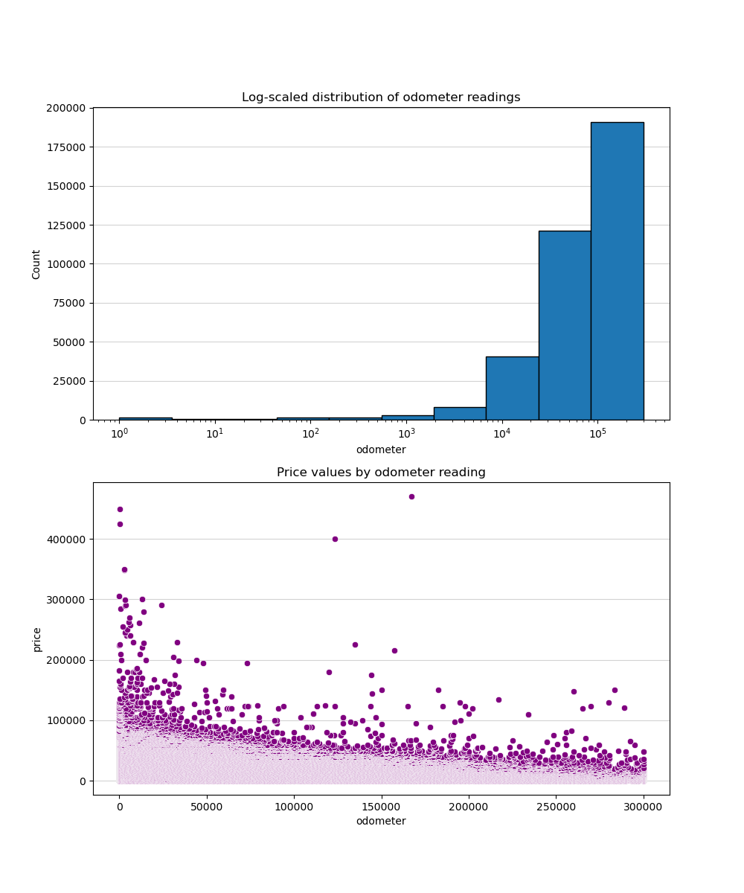
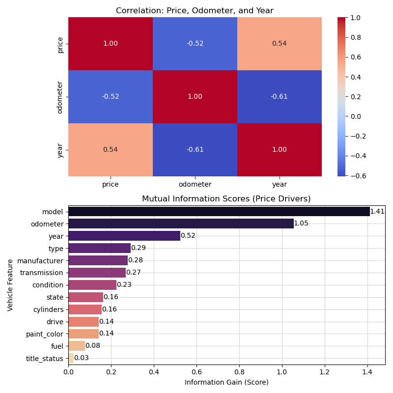
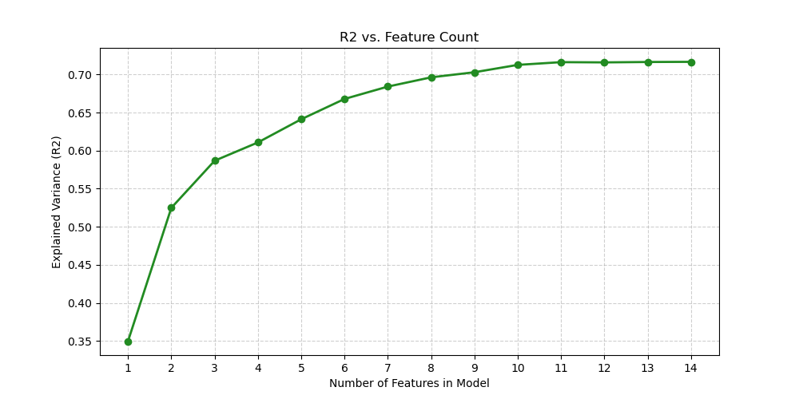
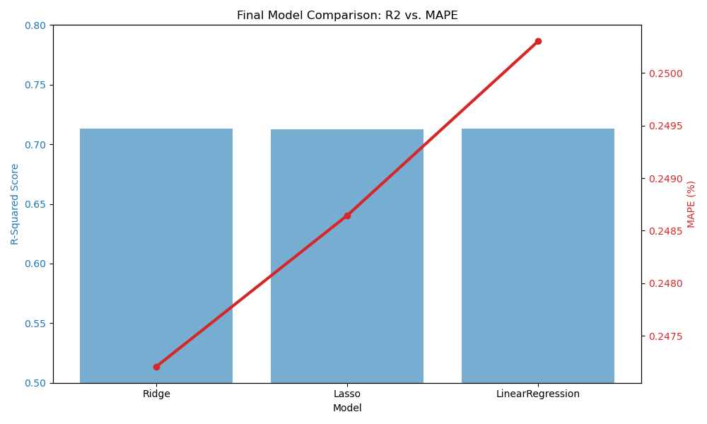

# UC Berkeley Professional Certificate in ML + AI: Practical Assignment 2

**Author**: Jelani Gould-Bailey

<h2 style="color: green;">Overview</h2>

---

For this assignment we were asked to analyze a 426k row data set and determine which car features have the greatest impact on the car price:

*"The original dataset contained information on 3 million used cars. The provided dataset contains information on 426K cars to ensure speed of processing.  Your goal is to understand what factors make a car more or less expensive.  As a result of your analysis, you should provide clear recommendations to your client -- a used car dealership -- as to what consumers value in a used car."*

The below document outlines my findings, methodology and analysis details.

<h2 style="color: green;">Executive Summary</h2>

---

**Objective:** My goal was to identify the specific vehicle attributes that drive market value and provide a data-driven tool for fine-tuning dealership inventory and pricing.

**The Strategy:**
I analyzed over 400,000 vehicle records, focusing on the "Heart of the Market" (vehicles within a common price range). To ensure that the model is useful at addressing the client's key question, I filtered the data to reflect a standard dealership's inventory:

- **Price Range:** 2,500 USD – 100,000 USD
- **Age:** Vehicles within a 15 year range (up to 2021)
- **Condition:** Vehicles with under 200,000 miles
- **Volume:** Only models with at least 50 historical sales (ensuring "statistical significance")

(see additional details in the Methodology section below)

### Key Findings: 

After extensive analysis and modelling, I was able to determine the following:

1. **Consumer value** is mostly driven by the top 3 features:
 Year, Model, and Engine Size (Cylinders). Surprisingly, factors like paint color and transmission type have a negligible impact on price compared to the mechanical "bones" of the vehicle.

1. **Model Error Rates:** Evaluation of my model indicates that outliers (e.g. cars that are hard to price, such as heavily modified cars) have an impact on pricing. The model is very accurate for "normal" cars, but it occasionally makes larger errors on rare or unique vehicles. On average, our model's price prediction is within ~25% of the actual market value (Mean Absolute Percentage Error of 24.7%).

1. **Feature Coverage:** (R2 score of 71.3%): Our model explains 71.3% of why one car costs more than another, based solely on data (e.g. "human emotion" is removed from the equation).

*Full breakdown of each feature's impact on our model's price calculation:*

<h2 style="color: green;">Recommendations & Supporting Details</h2>

---

1. **Prioritize "Freshness" Over "Miles":**
The model shows that the Year is the single greatest predictor of value. Consumers are more willing to pay for a newer model year than they are to pay for lower mileage on an older car.

    **Evidence:** In our SFS history, adding Year alone solved nearly 35% of the pricing puzzle.

1. **The "Cylinder Premium":**
Engine size is a major value-add. Moving from a 4-cylinder to a 6-cylinder or 8-cylinder engine consistently pushes the price higher across almost all types and manufacturers.

    **Evidence**: Cylinders was our #3 most impactful feature, adding a 6% gain in predictive power above and beyond the model and year.

1. **Focus on "Model Identity":**
Specific models (e.g., Ford F-150 vs. Toyota Camry) carry distinct value "signatures." The model name alone captures brand reputation and reliability that "Type" (e.g., Truck vs. Sedan) does not.

<h2 style="color: green;">Action Items for the Dealership</h2>

---

1. Standardize Intake Data: Ensure the acquisitions team records Year, Model, and Cylinders with 100% accuracy. Since these drive 60%+ of the price, a typo here leads to a massive pricing error.

1. Inventory Shift: Focus on acquiring vehicles within our "sweet spot" (under 15 years, under 200k miles). The model is most accurate here, meaning your risk of overpaying is lowest in this segment.

1. Price Anchor: Use the model’s prediction as a "Floor Price." If the model predicts $15k and a buyer offers $11k, you have statistical proof that the car is undervalued.

<h2 style="color: green;">Constraints & Next Steps</h2>

### Model Constraints:

- The "Luxury/Classic" Gap: This model is not designed for vehicles over $100k or classic cars over 15 years old.  These require specialized "appraiser" knowledge.

- Regional Variance: While we included "Region" as a feature, the model is currently a national average.

<h2 style="color: green;">Next Steps:</h2>

---

1. Deployment: Integrate the Ridge Regression model into a simple spreadsheet tool for the sales desk.

1. Regional Deep-Dive: Run a sub-analysis on your specific state/region to see if local trends (e.g., 4WD demand in snowy states) can squeeze out another 2–3% accuracy.

1. Explore whether a secondary model for expensive cars would be beneficial.

1. Real-Time Feedback: Track the "Actual Sale Price" vs. "Model Prediction" over the next 90 days to "calibrate" the model to your specific lot's performance.

 
 

---

<h2 style="color: green;">Reference Links:</h2>

---

- [Jupyter notebook](https://github.com/jelanigb/uc_berkeley_ml_program/blob/main/practical_application_02/module_11_prompt_jgb.ipynb) for this project
- [Generated plots](https://github.com/jelanigb/uc_berkeley_ml_program/tree/main/practical_application_02/images) from this project

<h2 style="color: green;">Project Methodology:</h2>

---

This project was completed using the [CRISP-DM](https://en.wikipedia.org/wiki/Cross-industry_standard_process_for_data_mining) framework:

1. Business Understanding
2. Data Understanding
3. Data Preparation
4. Modelling
5. Evaluation
6. Deployment

### Data Understanding
During the Data Understanding phase I completed extensive analysis to investigate different properties of the dataset as well as looking at different features using statistical tools and plots.

Data Understanding required an iterative approach -- the initial set of filters applied to the data was too broad. Data Understanding also uncovereed some conditions in the data which rqeuired cleaning during the Data Preparation phase.

 <h2 style="color: green;">[2.0] Data Understanding</h2>

---

### Methodology:

For the Data Understanding phase of CRISP-DM, I analyzed the dataset of 426k used cars and examined the metadata to better understand the form and content that is present. 

#### [Data Structure & Sparse Rows]:

I looked closely at the variance in non-null values across features, and decided how to handle null data case-by-case. In some cases it was appropriate to drop the rows; in other cases it was better to use [imputation](https://en.wikipedia.org/wiki/Imputation_(statistics)).

#### [Feature Data Types]:

I also looked closely at the `dtype` of our features:

- **Numeric Features:** I examined their statistical properties (e.g. mean, median, standard deviation). 
- **Non-Numeric Fetaures:** I needed to see which are categorical and determine an approach (generally, One-Hot Encoding for features with low cardiality, and Target Encoding for features with high cardinality. We  carefully managed the data to reduce risk of target leakage).

#### [Data Filtering Criteria]:

I identified data filtering criteria such as:

- **Outliers:** We looked at variance in feature values and use statistical tools such as IQR to evaluate the data for outliers.
- **Redundant Features:** We had to think critically about whether there are redundant features in the data, so that we do not fall into the [Curse of Dimensionality](https://en.wikipedia.org/wiki/Curse_of_dimensionality).
- **Unneeded Features:** We determined that some features were unneeded based on our output goals.

#### [Visual Examination]:

After undertaking some exploration of the data structure, properties and values, I generated some plots of the data, for a visual examination of properties to look for additional relationships in the data. 

<h2 style="color: green;">[2.1] Data Understanding - Initial Findings Based on Data Attributes</h2>

---

Initial examination of the data revealed some useful information:

1. The target feature -- `price` -- has good variation within 25 - 75% quartiles. There is an order-of-magnitude difference between 25% and 75% values (5900 USD vs. 26,485.75 USD), with an [IQR](https://en.wikipedia.org/wiki/Interquartile_range) of 20,585.75 USD.

1. The price feature also has wide outliers, based on eyeballing the min (0 USD) and max (3.7 billion) values as well as noting that the mean is higher than the 75% value (mean is skewed right by outliers). The standard deviation is also several orders of magnitude higher than the IQR. 
    - The max value for price is clearly an error -- no used car costs 3.7 billion -- and the min value of 0 USD also doesn't make sense for this purpose. We will need to filter.
    - However using `IQR * 1.5` in fence calculations probably isn't the best approach here -- since Q1 value is so low, the lower bound will be negative (0 USD values will be kept); and the upper bounds will only be set to 57,364.38 USD, which could exclude some luxury cars, which will create unintended bias in the model.
    - We'll start with a manual filter on price (>= 500 USD and <= 500k USD) before plotting, and finalize this approach during the Data Preparation phase.

1. There is also high variance in non-null values across attributes. The attribute with the lowest number of non-nulls (`size`) contains values such as 'compact'. A prelinminary assupmtion is that there could be some relationship between this categorical attribute and the final price, however since this value exists for only ~1/4 of the rows, it is not a good candidate for imputation and should be discarded. Fortunately there is another categorical attribute -- `type` -- which includes values such as 'truck', 'coupe', and 'sdean', which has values for ~3/4 of the rows, so this could be a suitable attribute to for signal related to the size of the vehicle (e.g. trucks will be larger than coupes).

1. `ID` and `VIN` are noise and can be discarded.

1. The `year` and `region` features also have a lot of variance.
    - `year` min value is 1900. For our model we can initially assume that cars > 40 years old could be considered "classic" and therefore out of the range that used car dealerships would target (unless they specialize in classic cars). We can filter on year and refine further during Data Preparation if needed.
    - An examination of `region` unique values reveals that they are inconsistent (e.g. cities, metros, and araes of states are all included) and very broad (400+ unique values). We can discard this data. A regional attirbution may be useful for identifying pricing trends, assuming it could be more streamlined. We'll explore whether a more meaningful regional association can be constructed from the `state` values during the Data Preparation phase.

1. The `odometer` feature is also somewhat noisy -- the max value is 10m miles, which seems unrealistic in a real-world used car market. We can safely assume that used car dealers likely wouldn't want to purchase a used car with > 300k miles (even that is arguably too high, but seems like a reasonable set of values to include for predictive purposes).

Next I examined the data visually using Seaborn plots.

### Car Price Distributions:

### Car Volume Distribution:

### Car Pricing & Volumes by Year:

### Odometer Details:

### Correlation & Mutual Information Scores:

<h2 style="color: green;">[2.2] Data Understanding - Conclusions:</h2>

---

The visual plots were helpful; they provided some additional insights about the data:

- Moderate positive correlation between `year` & `price` (newer cars are generally priced higher).
- Moderate negative correlation between `odometer` & `price` (lower mileage cars are generally priced higher). This is also reflected on the scatterplot.
- Some luxury brands (Ferrari, Aston-Martin) have high mean prices but the confidence interval for this signal is low -- volume for these brands is also very low relative to other manufacturers.
- The log-scaled distribution of `price` and `odometer` makes the variance easier to visualize.
- Pre-1996 volume is fairly low, and there is a dip in price between 1986 to 1996. This could indicate different things (e.g. perhaps 40 year old cars are starting to fall into the "classic" category). Since volume is low, we'll trim to a 30 year range for modelling.
- Year 2022 is relatively sparse, and prices drop sharply that year (likely not enough diversity in the volume), so we'll trim that year as well.
- The MI scores revealed strong information gain related to `model`, which is enticing. However looking more closely at the value counts and values for this feature it is clear that it's quite noisy -- model names include lots of variations, e.g. '1500' vs. 'silverado 1500' vs. '1500 crew cab big horn' are all variations of the same vehicle. Doing some analysis on the counts revels that there are 24666 unique values; 5577 of those have > 5 entries; 7749 > 3; 12404 > 1. So although it is a dirty long-tail distribution, there are still > 5k with > 5 entries, and the MI score is high, indicating this is a strong predictor. I'll attempt to clean the data (e.g. mapping long-tail categories to 'Other') in Data Preparation, rather than discard it outright. I'll have to be mindful of overfitting risk.
- The MI scores also confirmed that there is some information gain for features like `cylinders`, `drive`, `paint_color` as relates to `price` -- these pertain to vehicle trim options which are sometimes also part of the `model` name. There may be some redundancy in these features, and I was wary of the [Curse of Dimensionality](https://en.wikipedia.org/wiki/Curse_of_dimensionality); I'll make a final determination on whether to include them during Modelling.

<h2 style="color: green;">[3.0] Data Preparation</h2>

---

### Methodology:

**Data Cleanup**
1. **Data Structure:** Drop unneeded features, as informed by Data Understanding work.
1. **Data Filtering:** Filter rows based on boundary conditions.
1. **Data Cleanup:** String manipulation & consolidating long-tail categories into 'Other'.
1. **Type Conversion:** Modify data types as needed.
1. **Train-Test Split** on the cleaned data.

<h2 style="color: green;">[4.0] Modelling</h2>

---

### Methodology:

**Data Processing Pipeline**

1. **Data Transformations:** Imputation, encoding, Polynomialfeatures, scaling.
1. **Preprocessor Pipeline** Selectively applies data transformations via ColumnTransformer.

**Model Development**

1. **SFS**: Use SFS to find the best features + best number of features. Using manual SFS approach
in order to store result data for each incremental feature (allows us to answer the key question in
1.0 Business Understanding).
1. **Test Multiple Models** using the best feature set from SFS
1. **GridSearchCV** for hyperparameter tuning

<h2 style="color: green;">[4.1 - 4.3] Modelling Results</h2>

---

After several adjustments to the data during modelling, we were able to converge on a stable model, which had growing R2 as more features were added:

**Elbow plot learnings:** performance gains with these filters level off significantly after 10 features. I removed the additional features and focused on tuning the hyperparameters with `GridSearchCv`. 

To ensure we hwere driving the best model, I'll compare a `Ridge` model to `Lasso` as well as a `LinearRegression` model as a baeline. 

All 3 models will be optimized with the same data.

*Note:* There are other regression models to consider as well, e.g. `ElasticNet` and `RandomForrest`. Gradient Boost is also a possibility. At this stage in the course we hadn't covered those yet, but will in coming weeks. So I used `Ridge` and `Lasso` for now.

<h2 style="color: green;">[5.0] Evaluation</h2>

---

At the completion of modelling, all 3 models were showing comparable results on the test data, with `Ridge` having the lowest MAPE.

Based on the model evaluation metrics:

1. **MAE & MedAE:** MAE ($4,724) vs. MedAE (~$2,960) indicates that outliers (e.g. cars that are hard to price, such as heavily modified cars) have an impact on pricing. Our model is very accurate for "normal" cars, but it occasionally makes larger errors on rare or unique vehicles.
1. **$R^2$ (71.3%):** Our model explains 71.3% of why one car costs more than another, based solely on data (e.g. "human emotion" is removed from the equation). 
1. **MAPE (24.7%):** On average, our model's price prediction is within ~25% of the actual market value.

**Most Impactful Features**

Beacuse we ran SFS iteratively we also have good data on the impact of each feature on the final R2 score (see plot below). The top 3 (in order) are `year`, `model`, `cylinders`, which account for ~58% of car pricing. These features are heavily valued by consumers, as are the other 7 shown in the plot.

