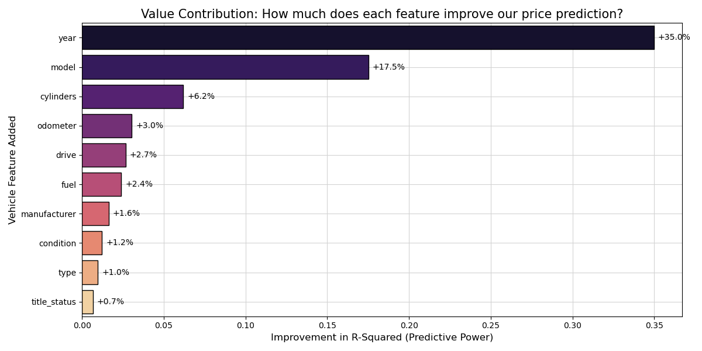

# UC Berkeley Professional Certificate in ML + AI: Practical Assignment 2

**Author**: Jelani Gould-Bailey

<h2 style="color: green;">Overview</h2>

---

For this assignment we were asked to analyze a 426k row data set and determine which car features have the greatest impact on the car price.

<h2 style="color: green;">Executive Summary</h2>

---

**Objective:** To identify the specific vehicle attributes that drive market value and provide a data-driven tool for fine-tuning dealership inventory and pricing.

**The Strategy:**
We analyzed over 400,000 vehicle records, focusing on the "Heart of the Market." To ensure the model is useful for daily operations, we filtered the data to reflect a standard dealership's inventory:

- **Price Range:** 2,500 USD – 100,000 USD
- **Age:** Vehicles from the last 15 years (up to 2021)
- **Condition:** Vehicles with under 200,000 miles
- **Volume:** Only models with at least 50 historical sales (ensuring "statistical significance")

### Key Findings: 
1. **Consumer value** is mostly driven by the top 3 features:
 Year, Model, and Engine Size (Cylinders). Surprisingly, factors like paint color and transmission type have a negligible impact on price compared to the mechanical "bones" of the vehicle.

1. **Model Error Rates:** Our model evaluation indicates that outliers (e.g. cars that are hard to price, such as heavily modified cars) have an impact on pricing. Our model is very accurate for "normal" cars, but it occasionally makes larger errors on rare or unique vehicles. On average, our model's price prediction is within ~25% of the actual market value.

1. **Feature Coverage:** (71.3%): Our model explains 71.3% of why one car costs more than another, based solely on data (e.g. "human emotion" is removed from the equation).

*Full breakdown of each feature's impact on our model's price calculation:*

<h2 style="color: green;">Recommendations & Supporting Details</h2>

---

1. **Prioritize "Freshness" Over "Miles":**
Our model shows that the Year is the single greatest predictor of value. Consumers are more willing to pay for a newer model year than they are to pay for lower mileage on an older car.

    **Evidence:** In our SFS history, adding Year alone solved nearly 35% of the pricing puzzle.

1. **The "Cylinder Premium":**
Engine size is a major value-add. Moving from a 4-cylinder to a 6-cylinder or 8-cylinder engine consistently pushes the price higher across almost all types and manufacturers.

    **Evidence**: Cylinders was our #3 most impactful feature, adding a 6% gain in predictive power above and beyond the model and year.

1. **Focus on "Model Identity":**
Specific models (e.g., Ford F-150 vs. Toyota Camry) carry distinct value "signatures." The model name alone captures brand reputation and reliability that "Type" (e.g., Truck vs. Sedan) does not.

<h2 style="color: green;">Action Items for the Dealership</h2>

---

1. Standardize Intake Data: Ensure the acquisitions team records Year, Model, and Cylinders with 100% accuracy. Since these drive 60%+ of the price, a typo here leads to a massive pricing error.

1. Inventory Shift: Focus on acquiring vehicles within our "sweet spot" (under 15 years, under 200k miles). The model is most accurate here, meaning your risk of overpaying is lowest in this segment.

1. Price Anchor: Use the model’s prediction as a "Floor Price." If the model predicts $15k and a buyer offers $11k, you have statistical proof that the car is undervalued.

<h2 style="color: green;">Constraints & Next Steps</h2>

### Model Constraints:

- The "Luxury/Classic" Gap: This model is not designed for vehicles over $100k or classic cars over 15 years old.  These require specialized "appraiser" knowledge.

- Regional Variance: While we included "Region" as a feature, the model is currently a national average.

<h2 style="color: green;">Next Steps:</h2>

---

1. Deployment: Integrate the Ridge Regression model into a simple spreadsheet tool for the sales desk.

1. Regional Deep-Dive: Run a sub-analysis on your specific state/region to see if local trends (e.g., 4WD demand in snowy states) can squeeze out another 2–3% accuracy.

1. Explore whether a secondary model for expensive cars would be beneficial.

1. Real-Time Feedback: Track the "Actual Sale Price" vs. "Model Prediction" over the next 90 days to "calibrate" the model to your specific lot's performance.