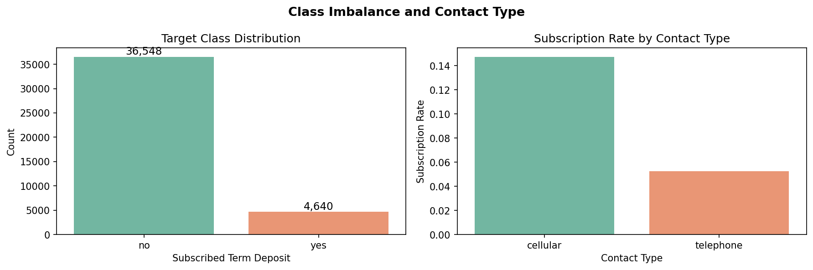
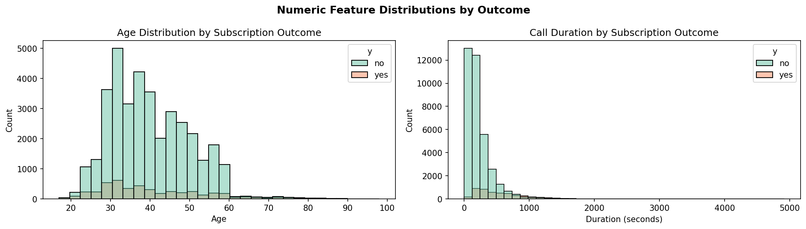
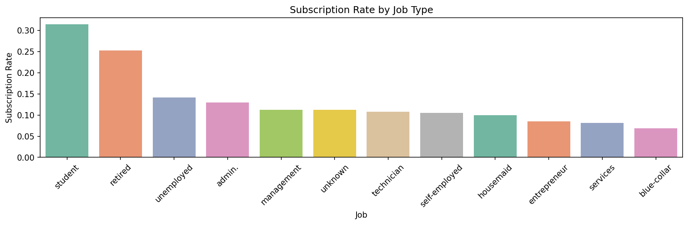
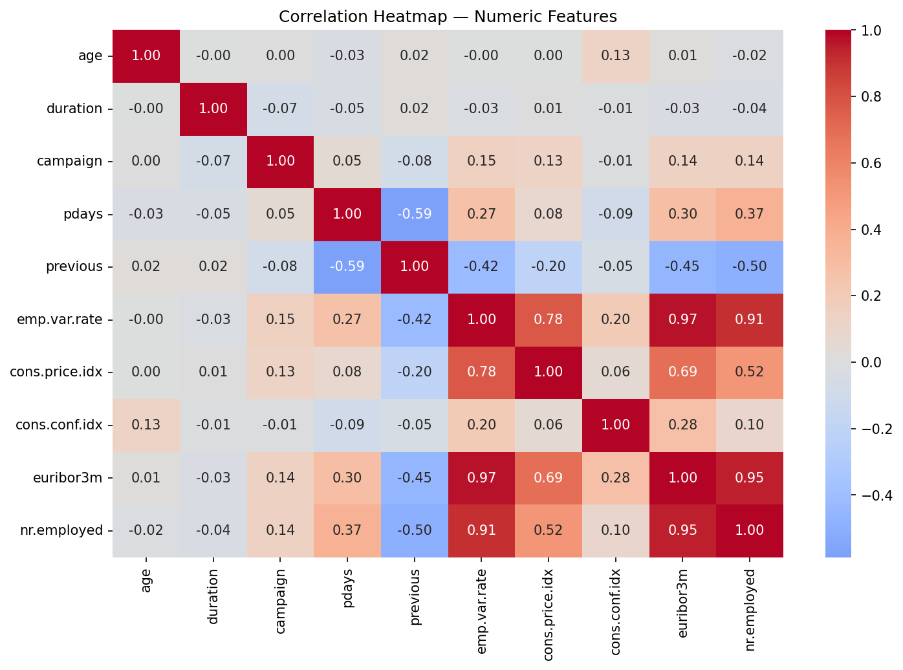
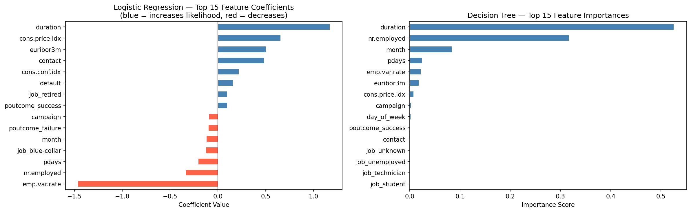

# Practical Application III: Comparing Classifiers

**Author**: Jelani Gould-Bailey

[View the full analysis in the Jupyter Notebook](prompt_III.ipynb)

---

## Overview

In this practical application, the goal is to compare the performance of the classifiers we encountered in this section, namely K Nearest Neighbor, Logistic Regression, Decision Trees, and Support Vector Machines. We will utilize a dataset related to marketing bank products over the telephone.

Our dataset comes from the [UCI Machine Learning repository](https://archive.ics.uci.edu/ml/datasets/bank+marketing). The data is from a Portugese banking institution and is a collection of the results of multiple marketing campaigns.

---

## Business Objective

Our business objective is to build a classification model to accurately predict whether a customer will subscribe to a product offering from a bank. For this task we will be using bank data captured from the [UCI bank marketing dataset](https://archive.ics.uci.edu/dataset/222/bank+marketing). Our target variable name in the original dataset is `y` which is a boolean representing "has the client subscribed a term deposit?".

Our approach will be to evaluate multiple classification models to determine which one is the best at predicting subscription outcomes from the marketing campaign. The specific models we will evaluate are Logistic Regression, KNN, Decision Trees, and Support Vector Machines (SVM).

---

## Initial Analysis

All 21 columns are present, and none have null rows. There are multiple categorical columns which could be converted to numeric columns via category encoding. For example `job` and `marital` are categorical columns with < 10 values. `month` and `day_of_week` are ordinal data. There are also several boolean features which could be a good fit for one-hot encoding.

There are also many columns which are already numeric (int64 or float64). This should be a good data set for modelling given the number of numeric and numerically encodable features.

Worth noting: one observation shared in the UCI description of the data is that we should discard the `duration` field:

> *last contact duration, in seconds (numeric). Important note: this attribute highly affects the output target (e.g., if duration=0 then y='no'). Yet, the duration is not known before a call is performed. Also, after the end of the call y is obviously known. Thus, this input should only be included for benchmark purposes and should be discarded if the intention is to have a realistic predictive model.*

However from the original study they included `duration` and found it to be impactful in a different way than was flagged for UCI:

> *Call duration is the most relevant feature, meaning that longer calls tend to increase successes.*

In other words this information could be valuable in a real-world scenario (e.g. as a goal for the sales person performing the pitch to ensure they surpass a certain duration to improve their chances of a successful conversion). There are only 4 / 41,888 rows which have a duration of exactly 0 and 53 which have a duration <= 5 seconds. For these reasons the `duration` feature is included.

---

## Exploratory Data Analysis

Before modeling, we examine key feature distributions and their relationship with the target variable (`y`) to surface patterns in the data.

### Class Distribution and Contact Type

The dataset is significantly imbalanced — approximately 89% of customers did not subscribe (`no`) and only 11% subscribed (`yes`). This class imbalance is an important consideration when evaluating models, as a naive classifier predicting "no" for every customer would achieve ~88.7% accuracy without learning anything useful. Cellular contact yields a noticeably higher subscription rate than telephone contact.

### Age and Call Duration Distributions

Subscribers tend to skew slightly older and have meaningfully longer call durations than non-subscribers. Call duration in particular shows a strong separation between the two classes — longer calls are strongly associated with successful outcomes.

### Subscription Rate by Job Type

Students and retired customers show the highest subscription rates, while blue-collar workers and housemaids show the lowest. This suggests customer segment targeting could meaningfully improve campaign efficiency.

### Correlation Heatmap

Several macroeconomic features (`euribor3m`, `emp.var.rate`, `nr.employed`, `cons.price.idx`) are highly correlated with each other, suggesting they capture similar underlying economic conditions. `duration` shows the strongest correlation with the outcome variable.

---

## Baseline Model

Our classifier must score above **88.74%** on test accuracy in order to outperform the baseline (a dummy classifier that predicts the most frequent class — "no" — for every observation).

---

## Initial Model: Logistic Regression

The initial Logistic Regression model has an accuracy of **91.22%** on the test data, above the 88.74% baseline.

---

## Model Comparison: Default Parameters

Using default settings for each model, we compared train time, train accuracy, and test accuracy:

| Model | Train Time (s) | Train Accuracy | Test Accuracy |
| ----- | -------------- | -------------- | ------------ |
| Logistic Regression | 0.15 | 0.9101 | 0.9122 |
| KNN | 0.03 | 0.9238 | 0.9016 |
| Decision Tree | 0.15 | **1.0000** | 0.8906 |
| SVM | 5.71 | 0.9179 | 0.9122 |

Logistic Regression and SVM had the highest test accuracy scores at 91.22% each. However SVM took 5.4 seconds to run while Logistic Regression only took 0.12 seconds. KNN performed slightly better than baseline at 90.16% accuracy with a much faster runtime (0.03 seconds). The worst performing model was Decision Tree, with a test accuracy of only 89.06% — barely above the 88.74% baseline. Looking at training results, Decision Tree had 100% accuracy on the training set, a clear sign of overfitting.

---

## Improving the Model: Hyperparameter Tuning and Additional Metrics

### Why Accuracy Alone Is Not Enough

Given the significant class imbalance in this dataset (~89% "no", ~11% "yes"), accuracy alone is a misleading metric — a model that predicts "no" for every customer would score 88.7% without learning anything useful. To get a more honest picture of model quality, we added four metrics:

- **Precision** — of all customers predicted to subscribe, what fraction actually did?
- **Recall** — of all actual subscribers, what fraction did the model catch?
- **F1** — harmonic mean of precision and recall; penalizes imbalance between the two
- **ROC-AUC** — measures ranking ability across all decision thresholds; robust to class imbalance

### Hyperparameter Tuning

We used `RandomizedSearchCV` with `cv=5` and `refit='roc_auc'` to tune each model. ROC-AUC was chosen as the refit criterion because it evaluates model quality across all decision thresholds rather than committing to a fixed 0.5 cutoff, making it well-suited for imbalanced classification tasks.

We initially attempted full `GridSearchCV` but found it impractical on this dataset (~41,000 rows) — the SVM search alone ran for over 15 minutes without completing. `RandomizedSearchCV` with `n_iter=10` samples a random subset of hyperparameter combinations rather than exhaustively trying all of them, dramatically reducing runtime while still exploring the parameter space meaningfully.

### Results

| Model | Precision | Recall | F1 | ROC-AUC | Test Accuracy |
|-------|-----------|--------|----|---------|---------------|
| Logistic Regression | 0.6629 | 0.4033 | 0.5014 | 0.6886 | 0.9121 |
| KNN | 0.5550 | 0.3419 | 0.4231 | 0.6535 | 0.9023 |
| **Decision Tree** | **0.6345** | **0.5148** | **0.5678** | **0.7386** | **0.9182** |
| SVM | 0.6523 | 0.3370 | 0.4443 | 0.6571 | 0.9122 |

**Decision Tree** is the strongest performer across all meaningful metrics — best F1 (0.5678), best ROC-AUC (0.7386), best Recall (0.5148), and best Test Accuracy (0.9182). Hyperparameter tuning (`max_depth`, `min_samples_leaf`) also successfully resolved the overfitting observed in the default model comparison.

**Logistic Regression** is a competitive second — it achieves the highest precision (0.6629), meaning when it predicts a subscription it is most likely to be correct, but its recall (0.4033) is the weakest among all models except SVM.

**SVM and KNN** underperform relative to their computational cost. SVM in particular has the lowest recall (0.3370), meaning it misses roughly 2 out of 3 actual subscribers.

All models have modest F1 scores (0.42–0.57), which is expected given the class imbalance. The gap between accuracy (~90%) and F1 (~0.5) highlights that high accuracy is partially an artifact of the majority class. For this business problem, **recall is arguably the most important metric**, since missing a potential subscriber represents lost revenue. On that basis, Decision Tree remains the recommended model.

---

## Model Interpretation: Feature Coefficients and Importances

To understand *what* the models learned, we examine the Logistic Regression coefficients and Decision Tree feature importances. Positive LR coefficients increase the predicted probability of subscription; negative coefficients decrease it. Decision Tree importances measure how much each feature reduces impurity across all splits.

Both models agree on the most important signals: **call duration** is the dominant predictor, followed by macroeconomic indicators (`euribor3m`, `emp.var.rate`) and prior campaign outcome (`poutcome_success`). In Logistic Regression, a successful prior campaign outcome has a strong positive coefficient, while high euribor rates have a strong negative one — consistent with the idea that customers are less likely to commit to a term deposit when interest rates are volatile.

---

## Next Steps and Recommendations

### Recommended Model

Based on our evaluation, the **Decision Tree** with tuned hyperparameters is the recommended model. It achieved the best balance of recall (0.51), F1 (0.57), and ROC-AUC (0.74) across all four classifiers evaluated.

### Actionable Insights for the Business

1. **Call duration is the strongest predictor** — Longer calls are strongly associated with successful subscriptions. Sales teams should be coached to keep prospects engaged past a minimum duration threshold, which could serve as a leading indicator of campaign success.

2. **Re-target prior subscribers** — Previous campaign outcome (`poutcome_success`) is a top predictor. Customers who subscribed in a prior campaign are significantly more likely to subscribe again and should be prioritized in outreach lists.

3. **Economic conditions influence outcomes** — Macroeconomic features (`euribor3m`, `emp.var.rate`) are highly correlated and predictive. Scheduling campaigns during favorable economic windows (lower rates, stable employment) may improve conversion.

4. **Prioritize cellular contact** — Cellular contact yields higher subscription rates than landline telephone. Where possible, prioritizing cellular outreach could meaningfully improve campaign efficiency.

5. **Target students and retirees** — These customer segments show the highest subscription rates by job type and may be worth prioritizing in future campaign targeting.

### Limitations and Next Steps

- **Class imbalance**: All models struggle with recall on the minority class (~11% positive rate). Adding `class_weight='balanced'` to model parameters or applying oversampling (e.g., SMOTE) are natural next steps that could meaningfully improve recall without requiring new data.

- **Decision threshold tuning**: Models currently predict "yes" when `predict_proba > 0.5`. Lowering this threshold increases recall at the cost of precision — the right tradeoff depends on the bank's campaign budget and cost per call.

- **Ensemble methods**: Random Forest or Gradient Boosting (XGBoost, LightGBM) typically outperform individual decision trees and would be strong candidates to evaluate in a follow-up study.

- **Feature selection**: With 36 engineered features, a dimensionality reduction step (e.g., using Decision Tree feature importances to drop low-signal features) could reduce noise and improve generalization.
